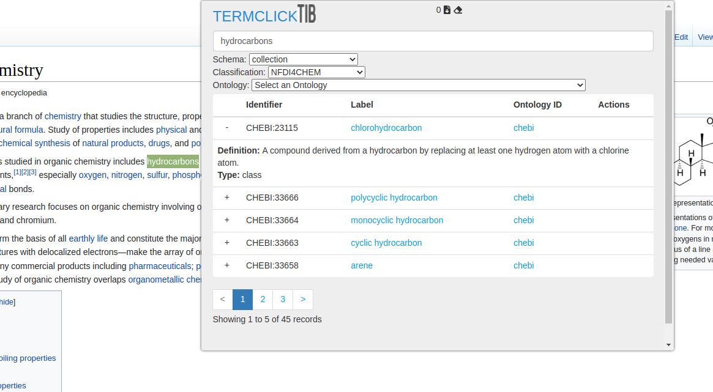

# Termclick


#### Turn a free text description into a proper ontology term with just one click.

### Overview

Termclick is a web browser extension for Chrome and Firefox browsers that lets the user highlight a piece of text and then tries to find a matching Ontology term for it.

Termclick currently supports matching terms in all the ontologies of TIB (Leibniz Information Centre for Science and Technology and University Library) Terminology Service.Besides, it is planned to add more Terminology Services to the interface in the long run. The search results can be copied to the clipboard or saved to a list that can be exported in .CSV format.

### Screeenshot



### Publication

*Ontoclick: a web browser extension to facilitate biomedical knowledge curation*\
[BioRxiv](https://www.biorxiv.org/content/10.1101/2021.03.04.433993v2) or [Bioinformatics (Oxford University Press)](https://doi.org/10.1093/bioinformatics/btab520)

### Acknowledgements

Termclick is developed based on the open source tool Ontoclick that was born at [Health Hack Sydney](https://speakerdeck.com/azankl/ontoclick-pitch-healthhack-2017) in November 2017. Many thanks to Team Ontoclick, in particular Graham Towse from [LivingryLabs](https://www.livingrylabs.net/) for developing the first prototype. Many thanks to Anthony Xu, Yifei (Frank) Luo, Aravind Venkateswaran, and Lianguizi (Alisa) Zhou, for further improving the OntoClick prototype.

### Install for Chrome

Termclick is available on the Chrome Store [here](https://chrome.google.com/webstore/detail/termclick/).

### Install for Firefox

Termclick is available as a Firefox Add-On [here](https://addons.mozilla.org/en-US/firefox/addon/termclick/)

### How to Use the Extension

1. Visit a web page in your browser
2. Highlight the text you want to search for, right-click to show the browser context menu and select Termclick from the context menu.
3. The Termclick popup opens and displays matching ontology terms from all the TIB Terminology Service ontologies.
4. Click on the '+' icon in front of a term to see more information about the term (if available).
5. Click on the Label of a term to navigate to its IRI. Click on the Ontology ID to navigate to the Ontology in TIB Terminology Service.
6. Hover over a term to see additional icons:
   - click the 'copy' icon next to the Ontology ID to copy the Ontology ID
   - click the 'copy' icon next to the Label to copy the Ontology Label
   - click the 'copy' icon in the 'Actions' column to copy the Ontology ID _and_ the Label
   - click the 'highlighter' icon in the 'Actions' column to copy the highlighted text _and_ the Ontology ID _and_ the Label.
   - click the 'disc' icon in the 'Actions' column to save the highlighted text, Ontology ID and Label to Termclick's history list. The number in the right upper corner of the Ontoclick window shows the number of items saved to the history list. Click the 'download' icon to download the history list as a .CSV file. 
   Click the 'rubber' icon to erase the history list.
7. Click on the Schema to list available schemas and click on a particular schema and see its respective classifications in the second dropdown list. Once you pick a particular classification, you will be able to perform a filtered search with respect to your choice. You can further narrow your search with respect to a particular ontology in the 3rd dropdown list.
8. The Termclick Popup can also be launched without selecting any text:
   - right-click anywhere in the browser window and select Termclick from the context menu that appears
   - click the Termclick icon in the browser toolbar
   - in both cases, you can now type your search term into the Termclick Search bar
   - Please note: the history list function is not available when launching the Termclick popup from the toolbar icon

### Install From Source

**Build Prerequisites**

* [Yarn](https://yarnpkg.com/en/docs/install)

``` bash
# install dependencies
yarn install

# build for production with minification
yarn run build

# To install, follow these steps:
Go to Chrome:
1. Visit chrome://extensions
2. Enable developer options
3. Click 'Load unpacked extension...'
4. Select the ontoclick/dist/ folder
```


### Development Setup

``` bash
# install dependencies
yarn install

# serve with hot reload at localhost:8080
yarn run dev

# build for production with minification
yarn run build

# run unit tests
yarn run unit

# run e2e tests
yarn run e2e

# run all tests
yarn test
```
